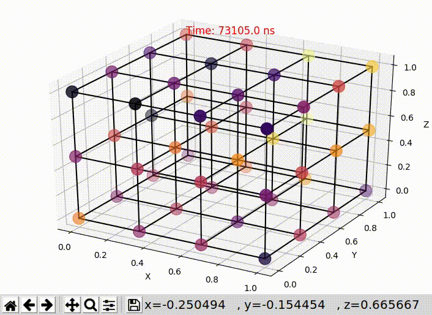
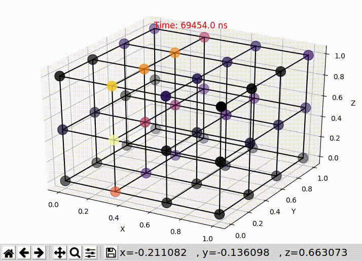

[](https://travis-ci.com/jmjos/ratatoskr)
[](https://www.codefactor.io/repository/github/jmjos/ratatoskr)
[](https://www.codacy.com/app/jmjos/ratatoskr?utm_source=github.com&amp;utm_medium=referral&amp;utm_content=jmjos/ratatoskr&amp;utm_campaign=Badge_Grade)

# Ratatoskr NoC simulator


Welcome to the project website of ratatoskr, a framework to design NoCs for heterogeneous 3D SoCs. It includes:

- A NoC simulator with support for heterogeneous 3D SoCs. In includes a high-level model of the router.
- A lightweight and efficient implementation of a 3D NoC router.
- Percise power models for links and routers.
- Integrated design tools.

It is developed at the University in Magdeburg, Germany and Bremen, Germany. The simulator is using C++14 and SystemCand is under MIT license terms. If you use the simulator in your research, we would appreciate the following citation in any publications to which it has contributed:

---

Jan Moritz Joseph, Sven Wrieden, Christopher Blochwitz, Alberto Garc&iacute;a-Ortiz, Thilo Pionteck: A Simulation Environment for Design Space Exploration for Asymmetric 3D-Network-on-Chip, 11th International Symposium on Reconfigurable Communication-centric Systems-on-Chip (ReCoSoC 2016), Tallinn, 2016

---

You can download the resources via this repo using a recursive git clone git clone --recursive https://github.com/jmjos/ratatorkr or directly on the individual repositories (VHDL router model and power models are shipped individually).

## Getting started

Here, we provide a quick tutorial. For in-depth instructions, please visit the [documentation](docs/TOC.md).

Let's start simple. You can a virtualbox image from [here](https://drive.google.com/open?id=1wDSwk0DIyzxVyD3pfzP4sBhK69QrsxN1). Boot it, login with demo/demo (user/pass). You'll find the simulator in ~/ratatoskr. We'll start from there. Let's start a terminal! (If you'd like to install the simulator on your own system, please read the detailed documentation in [the docs](TOC.md).

```bash
cd ~/ratatoskr
```

In this demo system, we already installed all packages and got ratatoskr, so you are ready to go. Let's first get the newest version:

```bash
git pull
```

and compile:

```bash
cd ~/ratatoskr/simulator
./build
```

After a short time, you'll get the executable `sim`. Let's run three simple examples!

## Different traffic patterns

In this part, we'll run uniform random traffic pattern and hotspot traffic pattern and visualize the differences with out GUI. Enter the demo folder and copy the executable and the configuration files:

```bash
cd ~/ratatoskr/bin/demo
cp ~/ratatoskr/simulator/sim .
```

In the `config` folder, you'll find the configuration of the simulator (`config.xml`) and the network, a 4 * 4 * 3 - NoC. They are already set up for the uniform random traffic pattern. The simulation is set to 1.5M clock cycles, which will take a while. But that's enough to observe the behavior of the NoC in the GUI! Let's to that:

We'll the the python venv and copy the required files for the GUI:

```bash
cd ~/ratatoskr/bin/
make
source source_me.sh
cd ~/ratatoskr/bin/demo
python ../plot_network_client.py
```

The GUI script is started and waits for the simulation to run. Let's open a second terminal, in which you run the simulator:

```bash
cd ~/ratatoskr/bin/demo
./sim
```

A GUI will open and show the buffer usage in each router. It's somewhat random...!



At the end of the simulation after a few minutes, you'll see the performance results:

```

```

Next, let's use hotspot traffic pattern. Therefore, we configure the simulator. Close the gui by pressing `q` in the window or using `Crtl-C` in the terminal. Change line 26 of the `config/config.xml` file from

```xml
<phase name="run">
  <distribution value="uniform"/>
  <start max="1100" min="1100"/>
```
to
```xml
<phase name="run">
  <distribution value="hotspot"/>
  <start max="1100" min="1100"/>
```

Rerun the simulation by executing `python ../plot_network_client.py` in the first terminal and `./sim` in the second. You'll recieve a rather boring but expected network load:



## Different routing algorithms

Let's use the heterogeneous XYZ routing, which puts more load to lower layers, instead of conventional XYZ. Therefore, we reconfigure the `config/network.xml` by changing the router properties in lines 12, 19, and 26 from

```xml
<nodeType id="0">
     <model value="RouterVC"/>
     <routing value="XYZ"/>
     <selection value="1stFreeVC"/>
     <clockDelay value="1"/>
     <arbiterType value="fair"/>
   </nodeType>
```
to
```xml
<nodeType id="0">
     <model value="RouterVC"/>
     <routing value="HeteroXYZ"/>
     <selection value="1stFreeVC"/>
     <clockDelay value="1"/>
     <arbiterType value="fair"/>
   </nodeType>
```
Remember to repeat three times! Also, we'll use uniform random traffic again, so update the `config/config.xml` (revert the changes made before).

Finally, you'll receive the following:


Thanks for making the tutorial. For further instructions, please use our [documentation](TOC.md). There, we also provide instrucions how to compile the simulator.

## Contributing
If you wish to contribute, please contact me at my univeristy email address jan.joseph@ovgu.de. We offer student development jobs for students from Magdeburg.

## People
The following people participated:
- [Lennart Bamberg](github.com/lennartjanis): Physical models, hardware implementation and optimization
- [Jan Moritz Joseph](https://github.com/jmjos): Simulation tools and design optimization
- [Prof. Dr.-Ing. Alberto García-Ortiz](www.ids.uni-bremen.de/agarcia.html)
- [Prof. Dr.-Ing. Thilo Pionteck](http://www.iikt.ovgu.de/pionteck.html)
- [Imad Hajjar](https://github.com/imadhajjar)
- Dominik Ermel
- Sven Wrieden

## Acknolegdements

This work is funded by the German Research Foundation (DFG) project GA 763/7-1 and PI 477/8-1.

We are very grateful for the help of [Prof. Dr. Volker Kaibel](https://www.math.uni-magdeburg.de/~kaibel/).

## License

This simulator is available to anybody free of charge, under the terms of MIT License:

Copyright (c) 2018 Jan Moritz Joseph

Permission is hereby granted, free of charge, to any person
obtaining a copy of this software and associated documentation
files (the "Software"), to deal in the Software without
restriction, including without limitation the rights to use,
copy, modify, merge, publish, distribute, sublicense, and/or sell
copies of the Software, and to permit persons to whom the
Software is furnished to do so, subject to the following
conditions:

The above copyright notice and this permission notice shall be
included in all copies or substantial portions of the Software.

THE SOFTWARE IS PROVIDED "AS IS", WITHOUT WARRANTY OF ANY KIND,
EXPRESS OR IMPLIED, INCLUDING BUT NOT LIMITED TO THE WARRANTIES
OF MERCHANTABILITY, FITNESS FOR A PARTICULAR PURPOSE AND
NONINFRINGEMENT. IN NO EVENT SHALL THE AUTHORS OR COPYRIGHT
HOLDERS BE LIABLE FOR ANY CLAIM, DAMAGES OR OTHER LIABILITY,
WHETHER IN AN ACTION OF CONTRACT, TORT OR OTHERWISE, ARISING
FROM, OUT OF OR IN CONNECTION WITH THE SOFTWARE OR THE USE OR
OTHER DEALINGS IN THE SOFTWARE.
